<!-- ═══════════════════════ ANIMATED TEXT/ASCII NATURE SCENE ═══════════════════════ -->
<div align="center">



</div>

<div align="center">


<br/>

<a href="https://github.com/NeonTechno"></a>
<a href="https://github.com/Decentralized-Rights-Protocol"></a>
<a href="https://decentralizedrights.com"></a>

</div>

<br/>

## 🌍 About Me

```yaml
name: Nkrumah Joel (NeonTechno)
role: Founder & Lead Architect, Decentralized Rights Protocol (DRP)
location: Cape Coast, Ghana 🇬🇭
education: Computer Science, Level 300 — University of Cape Coast (UCC)
leads: Robotics UCC Team — Season 2025
focus:
  - AI-powered rights-access scoring (UN SDG 10 & 16 alignment)
  - Post-quantum cryptography (CRYSTALS-Kyber / CRYSTALS-Dilithium)
  - Cosmos SDK blockchain architecture
  - Decentralized storage (OrbitDB / IPFS)
goal:
  - Launch DRP at testnet level
mission: "Fair resource distribution, ethical AI governance, and accessible
          systems — built and proven in Ghana, designed for the world."
```

<br/>

## 🛠️ Skills & Tech Stack

<div align="center">

**Languages**


**Web & Backend**


**Blockchain, AI & Data**


**Tools & Platforms**


</div>

<br/>

<div align="center">

**Specialized Stack**


</div>

<br/>

## 🚀 Currently Building

<table>
<tr>
<td width="50%" valign="top">

### 🔗 Decentralized Rights Protocol (DRP)
Cosmos SDK blockchain combining **AI-powered rights-access scoring**,
**post-quantum cryptography**, and **OrbitDB/IPFS** storage — built for
fair resource distribution aligned with **UN SDGs 10 & 16**.

- `PoAT` / `PoST` consensus · Elder Quorum governance
- `$RIGHTS` / `$DeRi` token economy
- AI Elders / **Project Lazarus** (cross-chain recovery, digital testaments)
- 🏆 Building for the **Ghana AI Innovation Challenge 2026**

</td>
<td width="50%" valign="top">

### 🤖 Robotics UCC Team — Season 2025
Leading recruitment, build strategy, and team operations for the
University of Cape Coast Robotics Team's 2025 season.

### 🧠 AI & Tooling
- `ai-orchestrator-agent` — LangGraph ReAct multi-agent system
- `ai-item-master-data-tool` — FastAPI + Next.js 15 extraction pipeline
- `drp-eldercore` — Discord.js v14 governance bot

</td>
</tr>
</table>

<br/>

## 📊 GitHub Stats

<div align="center">


<br/>


</div>

<br/>

## 📡 Connect

<div align="center">

<a href="mailto:joelcalebtech2018@gmail.com"></a>
<a href="https://decentralizedrights.com"></a>
<a href="https://github.com/Decentralized-Rights-Protocol"></a>

</div>

<div align="center">
<sub>🌿 Built from Cape Coast, Ghana — Yebɔa yɛ.</sub>
</div>


